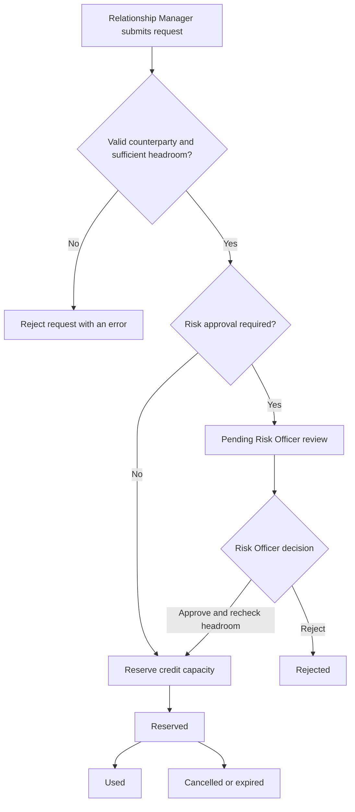

# LimitGuard

### Counterparty Credit Limit & Exposure Management Platform

**A full-stack Java and React application that models how a financial institution can set credit limits, track exposure, and control credit requests through a risk-approval workflow.**

LimitGuard was built as a Java/Spring Boot software engineering project. It is designed to make an unfamiliar banking process understandable through clear business rules, secure APIs, and an interactive dashboard.

> **Project scope:** LimitGuard is an educational, fictional simulation inspired by common banking risk-and-control concepts. It is not affiliated with Citi and does not implement or claim to represent any institution's internal credit policies. All demo banks, companies, users, and transactions are fictional.

## The idea, in plain English

Imagine a bank agrees that it can take on up to **BD 1,000,000** of credit exposure to a particular company. The bank needs to know how much of that allowance is already used, how much is reserved for upcoming activity, and how much remains available.

LimitGuard keeps track of these amounts and helps prevent requests that exceed the approved limit. Some requests can be reserved directly; others must be reviewed by a Risk Officer. If a company becomes too risky, the Risk Officer can freeze or close its status so no new credit requests are accepted.

### A quick example

| Item | Amount |
| --- | ---: |
| Approved credit limit | BD 1,000,000 |
| Already used | BD 300,000 |
| Reserved for approved activity | BD 200,000 |
| **Available headroom** | **BD 500,000** |

**Available headroom = Approved limit − Used exposure − Reserved exposure.**

A new request for BD 600,000 would exceed the available headroom and must not be allocated. A request that needs approval does not consume headroom merely because it was submitted; headroom is checked again before approval reserves it.

## Banking terms made simple

| Term | What it means in LimitGuard |
| --- | --- |
| **Financial institution** | The bank or financial organisation managing credit exposure. |
| **Counterparty** | The company or organisation on the other side of a financial relationship or transaction. In this demo, it is the company the bank is monitoring. |
| **Credit limit** | The maximum approved exposure a bank can have to a counterparty within a specific bank–counterparty relationship. |
| **Exposure** | The amount of financial risk currently taken or allocated under a limit. |
| **Used exposure** | Credit capacity that has already been used. |
| **Reserved exposure** | Credit capacity set aside for an approved request that has not yet been used. |
| **Headroom** | The remaining capacity under a credit limit. |
| **Credit request** | A request to use or reserve part of a counterparty's credit limit. |
| **Relationship Manager (RM)** | A bank employee who manages business relationships and submits credit requests. |
| **Risk Officer** | A bank employee who reviews higher-value requests and can approve, reject, freeze, or close relevant relationships. |
| **Maker-checker** | A control that separates the person requesting an action from the person approving it. |
| **Audit log** | A record of important actions, who performed them, and when. |

## Main features

- **Authentication and accounts:** JWT-based login, registration, email verification, password reset/change, and user profile management.
- **Role-based access control:** `RELATIONSHIP_MANAGER`, `RISK_OFFICER`, and `ADMIN` have different permitted actions, enforced by Spring Security on the backend.
- **Counterparty management:** Create, view, search, and update counterparties; use `ACTIVE`, `FROZEN`, and `CLOSED` statuses to control new activity.
- **Credit limits and headroom:** Maintain approved limits and track used, reserved, and remaining amounts.
- **Credit request lifecycle:** `PENDING_APPROVAL`, `RESERVED`, `USED`, `REJECTED`, `CANCELLED`, and `EXPIRED`.
- **Approval controls:** Risk Officer review, maker-checker restrictions, and a fresh headroom check when approving a request.
- **Auditability and notifications:** Audit logs, email notifications, and Server-Sent Events (SSE) for live credit-request updates.
- **REST API documentation:** Swagger UI / OpenAPI.
- **Frontend workspace:** React/TypeScript screens for credit requests, counterparties, exposure, and administration.
- **Development demo data:** Fictional institutions, employees, counterparties, limits, and credit-request histories seeded only for local development.

### Counterparty statuses

| Status | Meaning |
| --- | --- |
| `ACTIVE` | New credit requests may be submitted if other rules pass. |
| `FROZEN` | New credit requests are blocked while existing history is retained. |
| `CLOSED` | New credit requests are blocked; historical records remain available. |

### Credit request workflow



The current demonstration rule uses a value threshold to route larger requests for approval. This is a **project-specific example**, not a claim about any bank's actual policy.

## Technology stack

| Layer | Technologies |
| --- | --- |
| Backend | Java 17, Spring Boot, Spring Web MVC, Spring Data JPA, Hibernate |
| Security | Spring Security, JWT, BCrypt, method-level authorization |
| Database | PostgreSQL; H2 for isolated tests |
| Frontend | React, TypeScript, Vite |
| API documentation | Springdoc OpenAPI / Swagger UI |
| Testing | JUnit, Spring test tooling, Vitest, Playwright |
| Developer tools | IntelliJ IDEA, pgAdmin, Postman, Git, GitHub, Jira |
| Notifications | Spring Mail / SMTP, Server-Sent Events |

## Architecture

LimitGuard follows a **layered architecture**, separating responsibilities so that the code is easier to understand, test, and maintain.

```text
React frontend / Postman / Swagger UI
                 |
             REST API
                 |
          Controllers + DTOs
                 |
        Services (business rules)
                 |
        Repositories (Spring Data JPA)
                 |
            PostgreSQL

Cross-cutting: Spring Security, validation, exception handling,
audit logging, email notifications, and SSE events.
```

- **Controllers** receive HTTP requests and return API responses.
- **DTOs** define what data enters or leaves the API.
- **Services** apply business rules, such as checking headroom or blocking frozen counterparties.
- **Repositories** read and write database records.
- **Entities** represent the persisted banking data.

### Entity relationship diagram (ERD)

The database models financial institutions, users, counterparties, credit limits, credit requests, approval decisions, audit logs, and user tokens.

**[View the LimitGuard ERD on dbdiagram.io](https://dbdiagram.io/d/6abcbefa0f25a52d014bf6d3)**

## Roles and responsibilities

| Role | Main responsibilities |
| --- | --- |
| **Relationship Manager** | View permitted credit information; create and manage their permitted credit requests. |
| **Risk Officer** | Review and decide requests requiring approval; manage counterparties and credit limits as authorized. |
| **Admin** | Manage permitted user and administrative functions; does not automatically receive Risk Officer approval authority. |

Authorization is checked in the backend. Hiding a button in the frontend is **not** considered a security control.

## Running the project locally

### Prerequisites

- JDK 17
- PostgreSQL
- Node.js and npm
- Maven Wrapper (included in the repository)
- A local PostgreSQL database named `limitguard`, or an equivalent configured database

### 1. Configure development environment variables

The development profile reads database and email credentials from environment variables. Set these in your IntelliJ Run Configuration or your local shell; **never commit real secrets**.

| Variable | Purpose |
| --- | --- |
| `DB_URL` | JDBC PostgreSQL URL; defaults to `jdbc:postgresql://localhost:5432/limitguard` |
| `DB_USERNAME` | PostgreSQL username; defaults to `postgres` |
| `DB_PASSWORD` | PostgreSQL password |
| `GMAIL_USERNAME` | Sender email address for SMTP |
| `GMAIL_APP_PASSWORD` | Gmail app password for SMTP authentication |
| `LIMITGUARD_DEMO_PASSWORD` | Password for fictional demo accounts created by the development seeder |

Also inspect `src/main/resources/application-dev.properties` and the project's security configuration for any additional required JWT or local configuration values. The demo password should be supplied through the environment, not written into Java code.

### 2. Start the backend

On macOS/Linux:

```bash
./mvnw spring-boot:run
```

On Windows:

```powershell
.\mvnw.cmd spring-boot:run
```

The application uses the `dev` profile by default in the current local configuration. The backend runs on `http://localhost:8080` unless you change its port.

### 3. Start the frontend

In a separate terminal:

```bash
cd frontend
npm install
npm run dev
```

Open **http://127.0.0.1:5173**.

### 4. Explore the API

Once the backend is running, open:

**[Swagger UI — local development](http://localhost:8080/swagger-ui/index.html#/)**

> The Swagger URL is a localhost address. It only works on a computer where the LimitGuard backend is running; it is not a publicly hosted demo.

### 5. Run tests

```bash
./mvnw test
```

```bash
cd frontend
npm test
npm run build
npm run test:browser
```

Browser tests may require the Playwright browser dependencies and their configured test environment. The README does not imply every command has been rerun against the latest frontend changes.

## API overview

Some representative backend routes:

| Method | Route | Purpose |
| --- | --- | --- |
| `POST` | `/api/auth/users/register` | Register an account |
| `POST` | `/api/auth/users/login` | Authenticate |
| `GET` | `/api/auth/users/profile` | Read current user's profile |
| `POST` | `/api/credit-requests` | Submit a credit request |
| `GET` | `/api/credit-requests/my` | List permitted personal requests |
| `GET` | `/api/credit-requests/pending` | View requests awaiting review |
| `GET` | `/api/credit-requests/{creditRequestId}/review` | View a request's approval context |
| `PATCH` | `/api/credit-requests/{creditRequestId}/approve` | Approve an eligible request |
| `PATCH` | `/api/credit-requests/{creditRequestId}/reject` | Reject an eligible request |
| `PATCH` | `/api/credit-requests/{creditRequestId}/use` | Mark a reserved request as used |
| `PATCH` | `/api/credit-requests/{creditRequestId}/cancel` | Cancel an eligible request |

For request bodies, validation requirements, and the full set of endpoints, use Swagger UI or [`frontend/API_CONTRACT.md`](frontend/API_CONTRACT.md).

## Planning and project management

Development was organised into Jira stories and incremental milestones, covering authentication, data modelling, credit limits, request workflows, approvals, auditability, testing, and frontend integration.

**[View the LimitGuard Jira board](https://aliaburashid.atlassian.net/jira/software/projects/LG/boards/1/backlog?epics=visible&jql=parent%20IN%20%28LG-11%2C%20LG-5%2C%20LG-9%2C%20LG-8%29&selectedIssue=LG-7)**

> Jira may require permission or sign-in. The link is provided as a project-planning reference.

## My learning experience

### Favourite part: following a clear architecture

My favourite part of building LimitGuard was having a clear architecture to follow. Separating the project into controllers, services, repositories, entities, and DTOs made the development process much easier to understand. Once I understood how a request moves through these layers, I could focus on one responsibility at a time instead of trying to solve the entire project at once. This structure also made debugging and adding new features more manageable.

### Biggest challenge: learning the business language

The most challenging part at the beginning was understanding the financial terminology behind the project. Terms such as *counterparty*, *credit exposure*, *reserved amount*, *headroom*, and *maker-checker* were new to me. I needed to understand what each concept meant before I could translate it into meaningful Java business rules. Working through examples, mapping the database relationships, and testing the request lifecycle helped me connect the banking concepts to the code.

### What I learned

LimitGuard strengthened my understanding of layered backend architecture, relational data modelling, authentication and authorization, state transitions, transactional business rules, API documentation, and testing. It also taught me that understanding the **business problem** is just as important as writing the code.

## Future improvements

These are potential next steps, **not claims about features already delivered**:

- **Stronger institution isolation:** consistently scope all relevant API queries, approval actions, exposure calculations, and SSE notifications to the authenticated user's institution.
- **Richer dashboards:** institution-scoped portfolio totals, utilization trends, concentration views, and drill-down reports.
- **More intuitive selection:** searchable counterparty and credit-limit pickers with names rather than internal IDs.
- **More comprehensive testing:** cross-institution security tests, concurrency tests for simultaneous reservations, and end-to-end approval scenarios.
- **Advanced risk controls:** configurable approval thresholds, expiry policies, and exposure warnings.
- **Deployment:** containerised development and a secure hosted demo with secrets managed outside source control.

## References and learning resources

These are **technical documentation and learning resources**, not endorsements or evidence of real-world bank policy:

- [Spring Boot Reference Documentation](https://docs.spring.io/spring-boot/reference/)
- [Spring Security Reference](https://docs.spring.io/spring-security/reference/)
- [Spring Data JPA Reference](https://docs.spring.io/spring-data/jpa/reference/)
- [PostgreSQL Documentation](https://www.postgresql.org/docs/)
- [Spring Framework — Email Integration](https://docs.spring.io/spring-framework/reference/integration/email.html)
- [Spring Boot — Sending Email](https://docs.spring.io/spring-boot/reference/io/email.html)
- [Google Account Help — Sign in with app passwords](https://support.google.com/accounts/answer/185833)
- [MDN — Using Server-Sent Events](https://developer.mozilla.org/en-US/docs/Web/API/Server-sent_events/Using_server-sent_events)
- [OpenAPI Specification](https://spec.openapis.org/oas/latest.html)
- [OWASP — Access Control Cheat Sheet](https://cheatsheetseries.owasp.org/cheatsheets/Authorization_Cheat_Sheet.html)

## Project note

This repository is a portfolio/learning project using fictional demonstration data. It should not be used to make real lending, counterparty-risk, or regulatory decisions without appropriate domain review, additional controls, and production-grade validation.
